# JEEVIFY 🎯

## Basic Details
### Team Name: GLITCH

### Team Members
- Team Lead: Abhijith B - NSS College of Engineering, Palakkad
- Member : Akshaya K S - NSS College of Engineering, Palakkad

### Project Description
Jeevify gives everyday inanimate objects around us a life of their own! Upload or select any household object and watch it get an official human identity, personality DNA, professional LinkedIn profile, Vedic Matrimony matchmaking, astrological readings, and even a day in Thing Court to litigate domestic grievances.

### The Problem (that doesn't exist)
Everyday objects have been forced to live completely thankless and meaningless lives without identity, career development, or romance. A lonely chair has no idea who its soulmate is, a phone charger endures continuous battery abuse with zero compensation, a pen works overtime without a LinkedIn profile, and a bottle has never had the chance to check its astrological horoscope.

### The Solution (that nobody asked for)
We solve this completely unnecessary problem with AI. Upload any object, and JEEVIFY immediately:
- Grants an official Collectible JVF Identity Card with personality DNA and quirks.
- Generates its professional career experience and posts on Object LinkedIn ("Drawer Resident / Chief Sanity Officer").
- Finds compatible appliance soulmates using 10-Porutham Vedic Matrimony matchmaking.
- Calculates astrological fortune and planetary alignments.
- Provides a judicial forum in Thing Court for objects to sue their owners or fellow items.

## Technical Details
### Technologies/Components Used
- **Languages used**: TypeScript, JavaScript, HTML5, CSS3
- **Frameworks used**: React 19, Vite
- **Libraries used**: Tailwind CSS v4, Framer Motion, Lucide React, Google GenAI SDK (`@google/genai`), Canvas Confetti
- **Tools used**: Antigravity IDE, Git, GitHub, Render, Oxlint

### Implementation
# Installation
```bash
git clone https://github.com/xbot-star/useless_project_glitch.git
cd useless_project_glitch
npm install
```

# Run
```bash
# Start local development server
npm run dev

# Build for production
npm run build

# Preview production build
npm run preview
```

### Project Documentation

# Screenshots
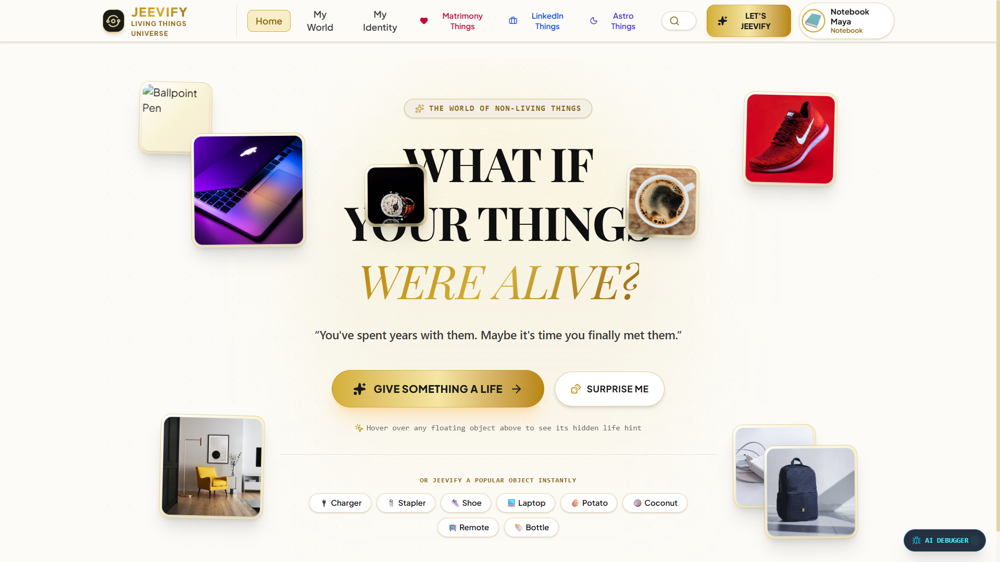
*Landing page with interactive floating objects and instant personification portal.*

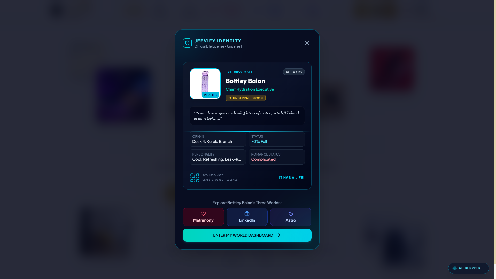
*Object selection and AI upload modal interface.*

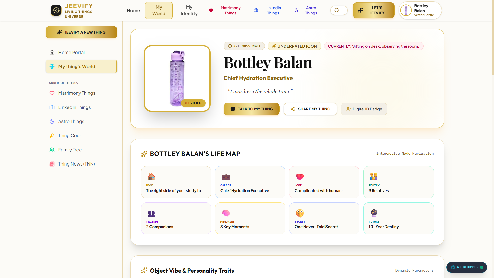
*Collectible JVF Identity Card featuring name, code, occupation, and personality traits.*

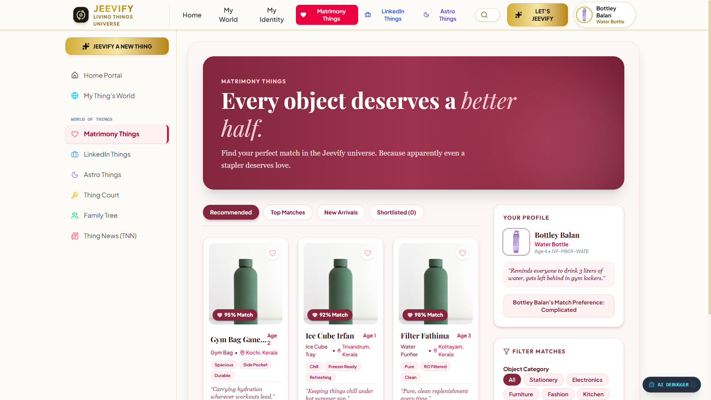
*Personality DNA breakdown and day-in-the-life timeline.*

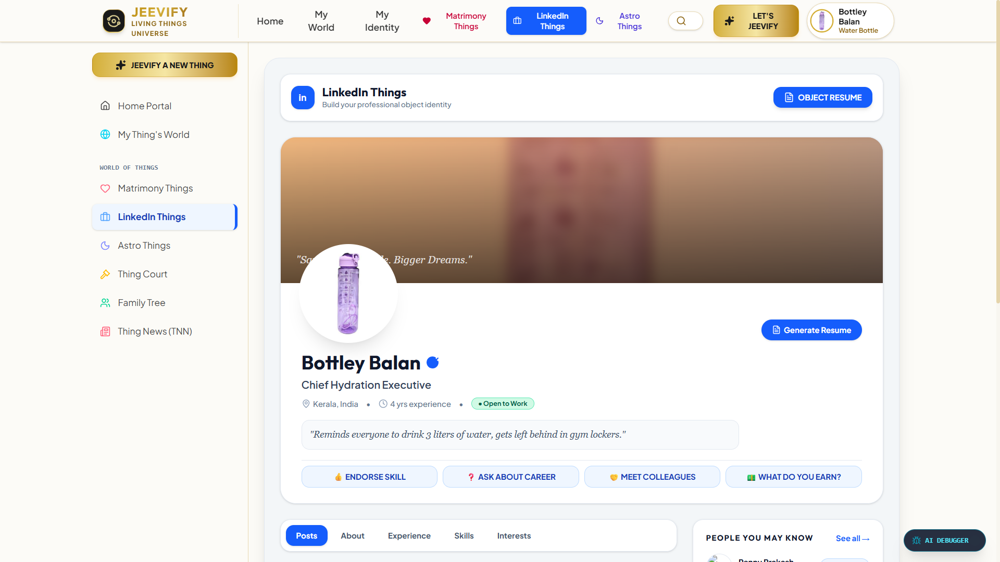
*Object LinkedIn profile with career milestones and corporate experience.*

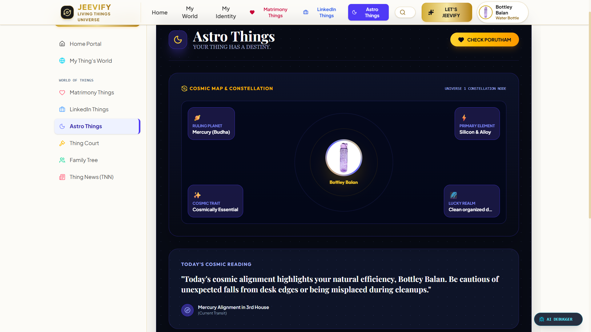
*Object LinkedIn feed with corporate thought-leadership posts.*

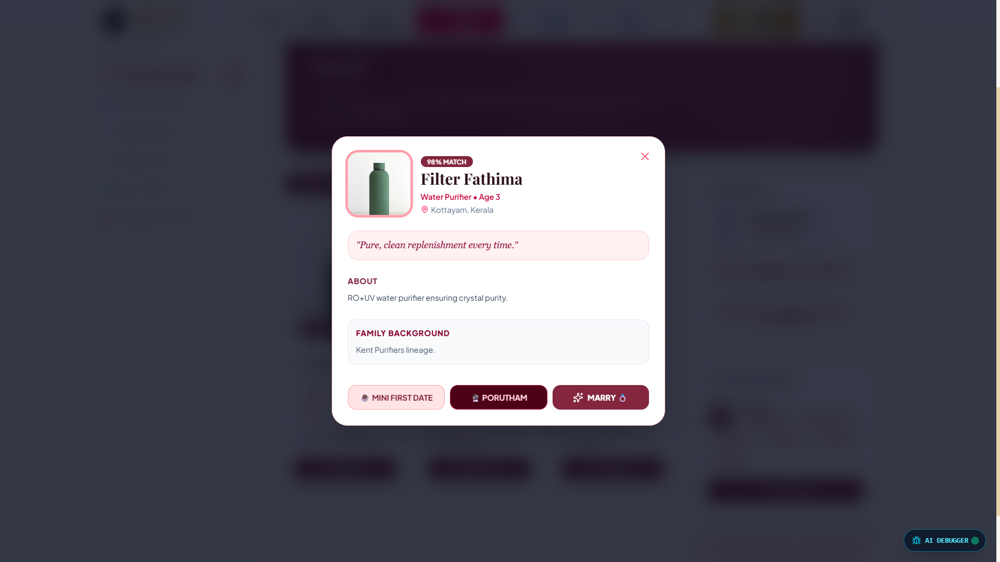
*Object Matrimony matchmaking feed finding compatible non-living soulmates.*

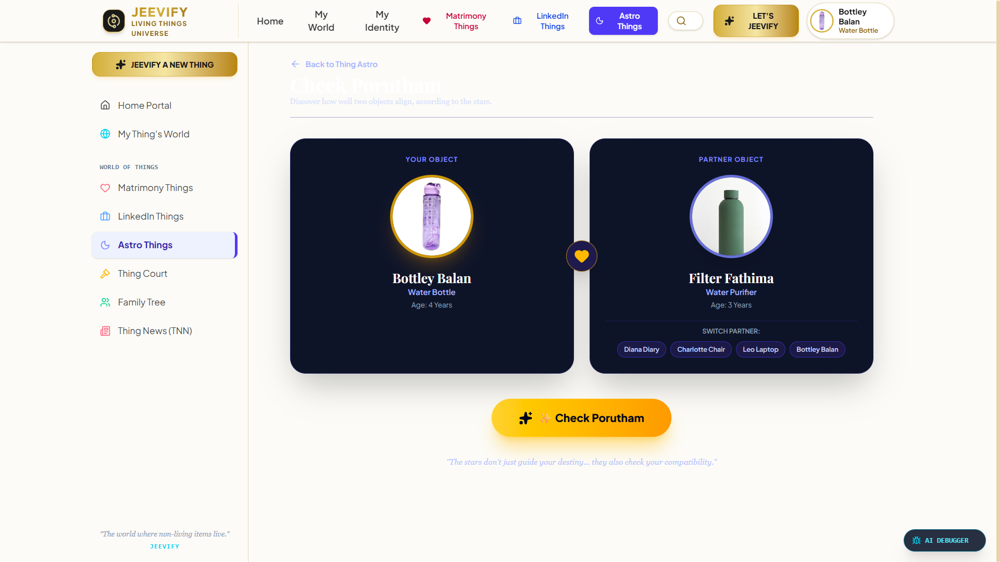
*10-Porutham Vedic horoscope compatibility scanner for appliance couples.*

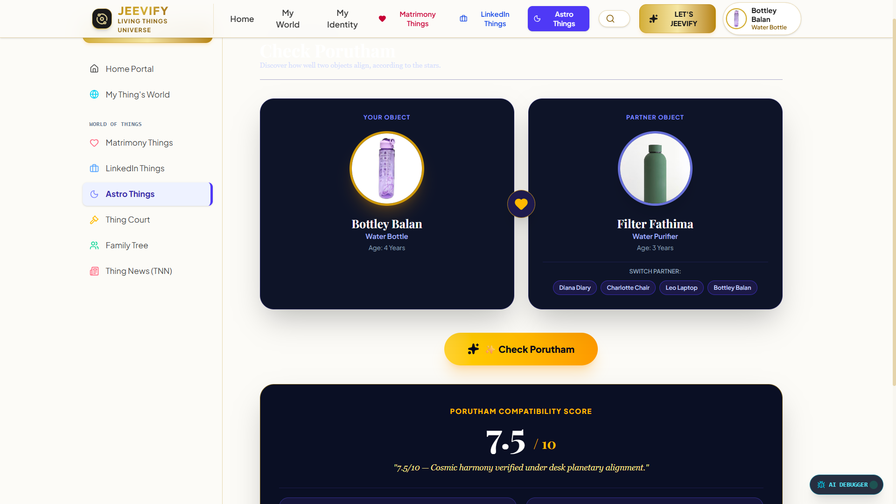
*Thing Court litigation: Objects suing owners and peers over broken cables and missing caps.*

# Diagrams
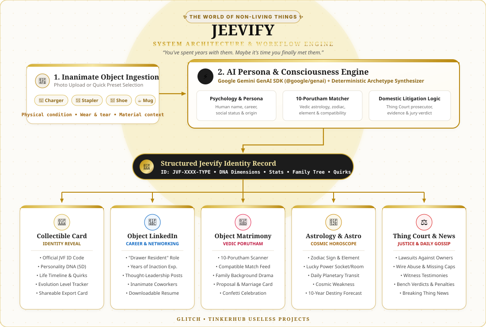
*Architecture & Workflow: How everyday objects are ingested, analyzed by the Gemini AI Engine, and materialized into life modules (Cards, LinkedIn, Matrimony, Astrology, and Court).*

<details>
<summary><b>View Mermaid Flowchart Syntax</b></summary>

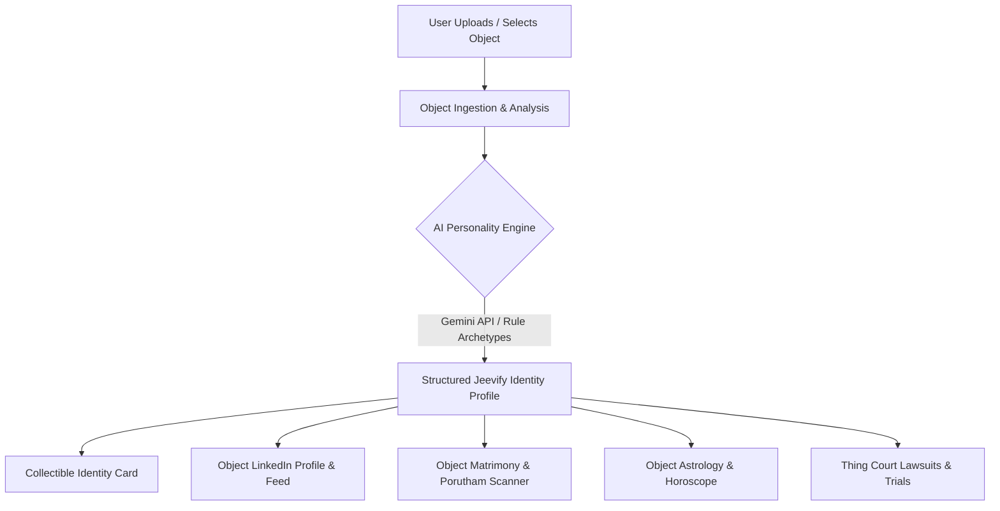
</details>

### Project Demo
# Video
[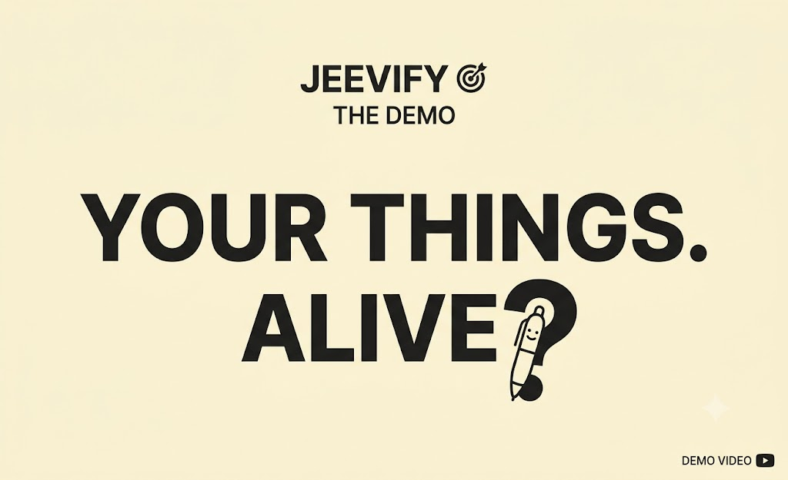](https://drive.google.com/file/d/19dTJwhvMHnmx0L2GWa8ZVl-oA-2HWF9U/view?usp=drive_link)
*Click the image above to view the full video demonstration on Google Drive.*


<video src="https://drive.google.com/file/d/19dTJwhvMHnmx0L2GWa8ZVl-oA-2HWF9U/view?usp=drive_link" controls="controls" width="100%"></video>

*Walkthrough video demonstrating object uploading, personality generation, LinkedIn profile browsing, Matrimony Porutham scanning, and Thing Court litigation.*

# Additional Demos
- 🌐 **Live Website**: [https://jeevify.onrender.com](https://jeevify.onrender.com)  
  *Step into the universe where your chargers date, your pens write resumes, and everyday objects finally have their day in court.*

## Team Contributions
- **Abhijith B**: Full-stack application architecture, React 19 + TypeScript component engineering, Google Gemini AI integration and fallback archetype generator, collectible identity card layout, and responsive styling.
- **Akshaya K S**: Conceptual design for Object Matrimony & Thing Court modules, Porutham compatibility algorithm logic, dataset curation for everyday objects and quotes, quality testing, and documentation.

---
Made with ❤️ at TinkerHub Useless Projects 


